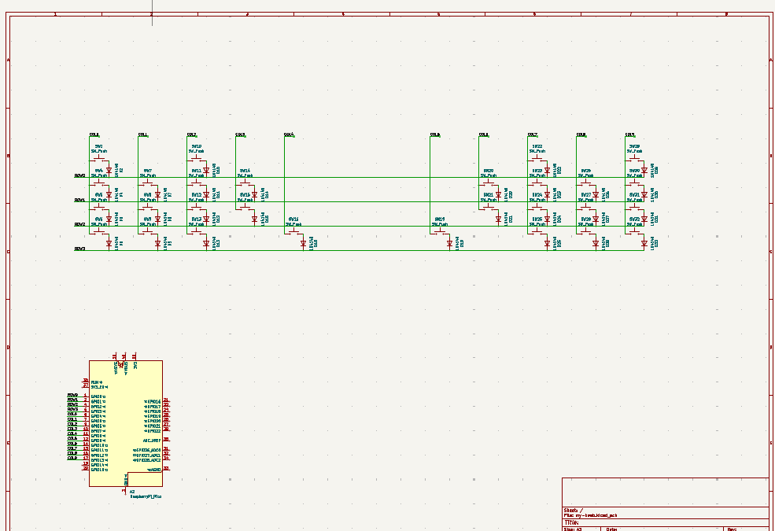
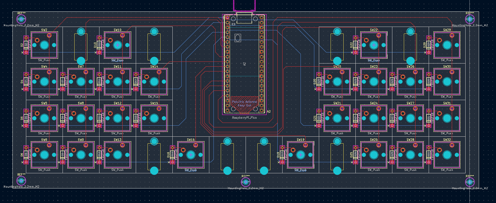
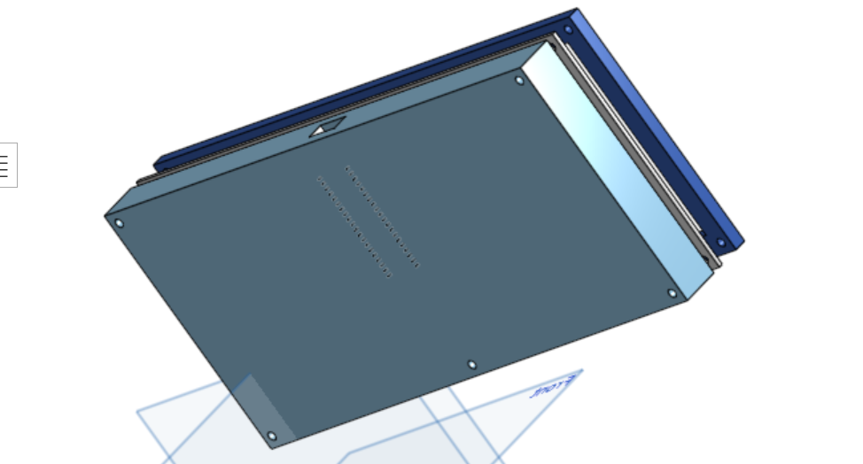
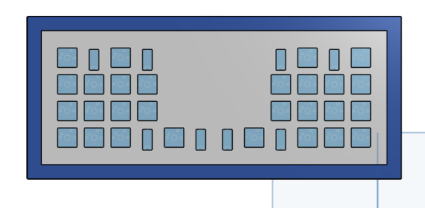

# Fatman 1.0

My DIY mechanical keyboard (sandwich mount). It has ***28 keys*** of which 4 are 3u keys. This keyboard is especially designed to play games that were meant to be played on a ***controller**: each key replaces a part of the controller. It is ideal for rhytm games, Tetris, Mortal Kombat and many other retro games.

# Why
My goal was to get a first feeling with hardware/pcb's. I think this is the perfect project to start with pcb's because the electronics part was pretty simple. That aside I do regret spending so much time on the case, as I think this is rather boring.

# The result
The keyboard will be shown down below when I get the parts.
What I learned:
- What makes up a keyboard
- How a switch matrix is constructed
- Making schematics in KiCad 10.0
- Designing the pcb in KiCad 10.0
- Designing an object in Onshape

## Schematic

## Pcb

## Case

You can see my learning process in the [Devlogs](devlogs/README.md)
